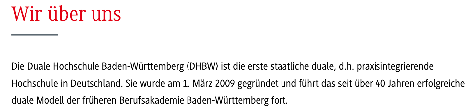
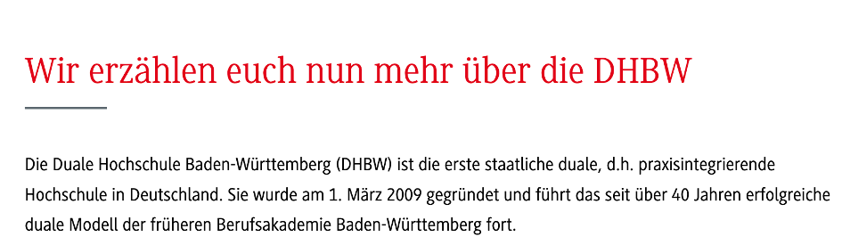

# Aufgaben Labor 1

## Aufgabe 2.2:

### 1. Für was steht die Deklaration <!DOCTYPE HTML>:

Die Deklaration steht für die Definition des Dokumententypes

### 2. Suchen Sie nach dem <HTML>-Tag und erklären sie die dort verwendeten Attribute (dir="ltr" lang="de-DE" class="no-js"):

- dir="ltr": Das „dir“-Attribut steht in HTML für direction und wird verwendet, um die Schreibrichtung von Text in einem Element zu definieren. In diesem Fall steht "ltr" für "left-to-right", was auf die Schreibrichtung von links nach rechts  hinweist.

- lang="de-DE":  Das „lang“-Attribut wird verwendet, um die Sprache des HTML-Dokuments zu definieren. Hier steht "de-DE" für die Sprache Deutsch in der Region Deutschland. Es wird als Sprache - Region angegeben

- class="no-js": Das class-Attribut wird verwendet, um dem HTML-Element eine oder mehrere Klassen zuzuweisen. In diesem Fall wird die Klasse "no-js" zugewiesen.

### 3. Welches ZeichensatzEncoding verwendet die Webseite:
Die Webseite verwendet als Zeichensatz Encoding UTF-8

### 4. Suchen Sie jetzt nach den folgenden Begriffen und klicken jeweils indem zugeordneten href-Attribut auf den in blauer Schrift angezeigten Text. Was passiert:

Es öffnet sich jeweils in einem neuen Tab die durch das href-Attribut verlinkte Seite.

## Aufgabe 2.3:

### 4. Wechseln Sie jetzt im rechten oberen Fenster zum Tab Netzwerk. In diesem Fenster sehen Sie den kompletten chronologischen Nachrichtenverkehr zwischen ihrem Browser und dem Web-Server. Verfolgen Sie den Netzwerkkehr ausgehend von der initialen Anfrage und beobachten Sie die sukzessive heruntergeladenen Webobjekte. Notieren Sie die ersten 5 Webobjekte und deren Ladezeit:

1. Startseite (HTML) Ladezeit 327 ms
2. css.css?1470992529 4ms (canceld)
3. cssvisited.css?14704617767 5ms (canceld)
4. vendor_header.min.js?vavp83 0ms
5. banner.js 0 ma
6. version.jason?v=1705008553660 27 ms

### 5. Wechseln Sie zurück zur initialen Webseitenanfrage (Name „startseite“) und extrahieren Sie die ersten 4 Headereinträge für den Request wie den Response- Header und erklären Sie deren Bedeutung:

#### Http Request:
- Host: Angefragter Webserver
- User-Agent: Version des Client-Browsers
- Connection: Status der gewünschten Verbindung
- Accept-language: Gewünschte Sprachversion der Seite

#### Http Response:
- Connection: Wie möchte sich der Server nach der Übertragung verhalten
- Date: Sendedatum
- Server: Softwareversion des Servers
- Last-Modified: Letztes Änderungsdatum des Webobjekts

### 6. Analog zu den CSS-Regeln lassen sich die die HTML-Einträge live verändern. Scrollen Sie zu dem „Wir über uns“ Bereich auf der Homepage. Klicken Sie mit de rechten Maustaste die Überschrift an und wählen untersuchen aus. Verändern Sie

die Überschrift mit den Entwicklungstools.

Vorher:

Nacher:

### 7. Wechseln Sie jetzt zum Tab Quellcode im rechten oberen Fenster. Auf diesemTab finden Sie eine Baumstruktur, die die zusammen mit der Webseite heruntergeladenen Webobjekte listet. Hierzu gehören beispielsweise Bilder, CSS- Dokumente und JavaScript-Dateien. Dort finden Sie unter anderem einen piwik- Ordner und eine piwik-JavaScript Datei. Welche Bedeutung hat piwik?
Piwik ist eine Open-Source-Webanalyse-Plattform, die dazu diente, Daten über die Besucher von einer Webseite zu sammeln und zu analysieren. Es ermöglicht Websiten-Betreibern, Einblicke in das Nutzerverhalten zu gewinnen, um Entscheidungen zur Verbesserung der Website-Erfahrung, der Benutzerfreundlichkeit und der Leistung zu treffen.

