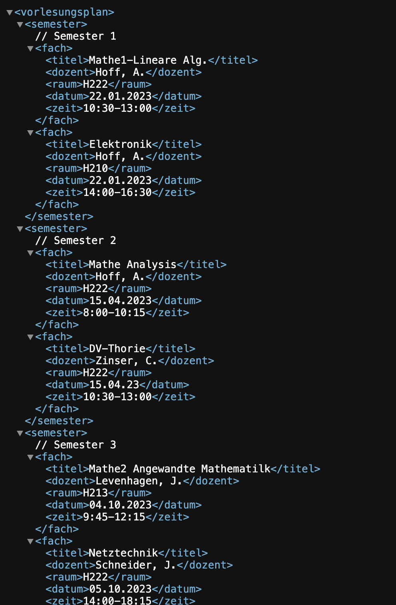
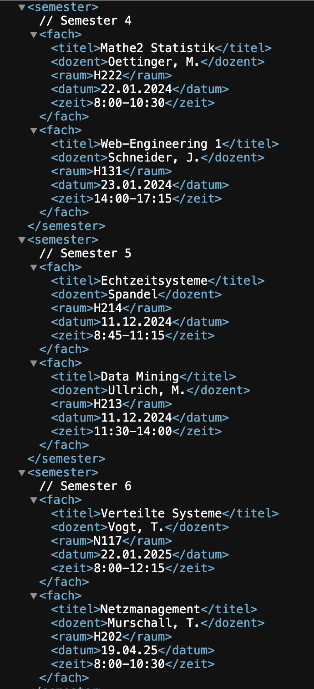
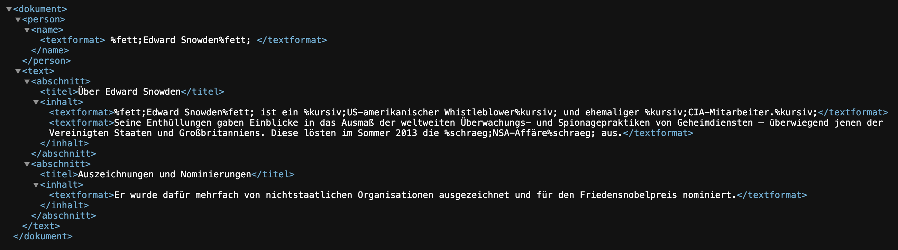

# Aufgaben Labor 2


## Aufgabe 1.1:
### 1. Recherchieren Sie zunächst im Internet nach dem Begriff XML Namespaces und erklären Sie den Einsatzzweck anhand eines konkreten Beispiels


XML Namespaces sind eine Möglichkeit, in XML-Dokumenten eindeutige Namenskonflikte zu vermeiden, wenn Elemente und Attribute aus verschiedenen Quellen stammen. Dies ist besonders wichtig, wenn verschiedene XML-Elemente oder Attribute denselben Namen haben könnten, aber unterschiedlichen Kontext oder Ursprung haben. XML Namespaces ermöglichen es, Elemente und Attribute zu gruppieren und zu kennzeichnen, um Kollisionen zu verhindern. Dies ist besonders relevant, wenn mehrere XML-basierte Sprachen oder Anwendungen in einem einzigen Dokument verwendet werden.

##### Beispiel:

```
<book>
  <author>
    <name>John Doe</name>
  </author>
  <publisher>
    <name>XYZ Publications</name>
  </publisher>
</book>


```

###### Mit Namespace

```
<book xmlns:author="http://example.com/authors"
      xmlns:publisher="http://example.com/publishers">
  <author:name>John Doe</author:name>
  <publisher:name>XYZ Publications</publisher:name>
</book>
```
Durch die Einführung von Namespaces mit den Präfixen "author" und "publisher" wird deutlich, welches "name"-Element zu welchem Namespace gehört.


 ### 2. e) Laden Sie ihre XML-Datei in einen Browser. Kann die XML-Datei fehlerfrei geladen und wird die von Ihnen entworfene Baumstruktur angezeigt?

Die Anzeige funktioniert ohne Probleme siehe Bild:




## Aufgabe 1.2:
### 2. Auf Basis der DTD-Datei speichern sie den obigen Text als XML-Datei. Überprüfen Sie ihr Modell in einem XML-Validator und zeigen sie die entworfene Baumstrucktur in einem Browser an.

Darstellung im Browser:



## Aufgbae 2.2:

### 5. Erklären Sie den Begriff Glyphe anhand von Beispielen.

Eine Glyphe bezieht sich auf ein grafisches Symbol oder einen Schriftzeichenentwurf, der eine bestimmte Schriftart oder einen bestimmten Zeichensatz repräsentiert. Es ist die visuelle Darstellung eines Zeichens in einer Schriftart. Zum Beispiel repräsentiert der Buchstabe "A" eine Glyphe in der Times New Roman-Schriftart, und derselbe Buchstabe "A" repräsentiert eine andere Glyphe in der Arial-Schriftart. Jede Schriftart kann ihre eigenen einzigartigen Glyphen für die gleichen Zeichen haben. In der Typografie und Schriftgestaltung wird viel Wert auf die Form und das Design von Glyphen gelegt, um eine ästhetisch ansprechende Darstellung von Text zu gewährleisten.


### 6. Können die obigen Unicode-Zeichen in einem Terminal ausgegeben werden? Erklären Sie ihre Beobachtung.

Die obigen Unicode zeichen können ohne Probleme im Terminal angezeigt werden, weil das Terminal den Unicode Zeichensatz untersützt